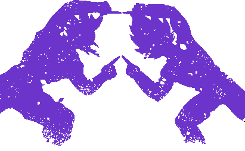

# deep-fusion
Recursively merge nested objects.  


## Documentation
* [Changelog](CHANGELOG.md)

## Installation
```sh
npm install --save deep-fusion
```

## Usage
The example code is [here](examples/fusion.js).

```js
const fusion = require('deep-fusion');

const a = {a: 'hello'};
const b = {b: 123};
const c = {c: true};
fusion(a, b, c);
// => {
//   "a": "hello",
//   "b": 123,
//   "c": true
// }

const x = {a: {b: 0}};
const y = {a: {b: 1, c: 2}};
const z = {a: {c: 3}};
fusion(x, y, z);
// => {
//   "a": {
//     "b": 1,
//     "c": 3
//   }
// }
```

## Author
**Takuya Motoshima**

* [github/takuya-motoshima](https://github.com/takuya-motoshima)
* [twitter/TakuyaMotoshima](https://twitter.com/TakuyaMotoshima)
* [facebook/takuya.motoshima.7](https://www.facebook.com/takuya.motoshima.7)

## License
[MIT](LICENSE)